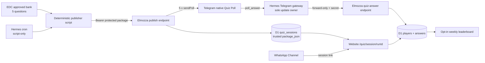

# Blueprint Arsitektur — Elmozza Omnichannel Quiz

Status: **MVP selesai dan terverifikasi lokal; belum diaktifkan di produksi**  
Tanggal: 22 Agustus 2026

## 1. Tujuan

Satu paket kuis yang sudah berstatus `APPROVED` menjadi sumber tunggal untuk:

- lima native **Telegram Quiz Poll** non-anonim;
- satu sesi website berisi lima soal yang sama;
- penilaian dan leaderboard bersama di Cloudflare D1;
- tautan kuis yang dapat dibagikan melalui WhatsApp Channel.

Kunci jawaban tidak dibuat ulang oleh Hermes dan tidak dikirim ke browser. Sumber paket berada di `edc-conversation-engine/content/bank/`.

## 2. Arsitektur



**Batas utama:** Hermes tetap satu-satunya pemilik polling/webhook Telegram. Elmozza tidak pernah memanggil `setWebhook` atau `getUpdates`, sehingga bot tidak saling berebut update.

## 3. Kontrak paket

Setiap publikasi wajib memiliki:

- `id`, `run_id`, `title`, dan `source`;
- tepat **5 pertanyaan**;
- tepat 4 pilihan per pertanyaan;
- `correct_index` yang valid;
- penjelasan yang sudah direview;
- `review_status = APPROVED` pada paket sumber.

Validator menolak paket kurang/lebih dari lima soal, pilihan duplikat, kunci di luar rentang, ID pertanyaan duplikat, dan teks yang melampaui batas Telegram.

## 4. Komponen

| Komponen | Lokasi | Fungsi |
|---|---|---|
| Core contract | `src/lib/server/omnichannel-quiz-core.ts` | Validasi, public projection, grading, payload Telegram, idempotency key |
| Migration | `migrations/0008_omnichannel_quiz.sql` | Sessions, publications, players, answers, privacy opt-in |
| Publisher | `src/routes/api/quiz/publish/telegram/+server.ts` | Simpan paket, tutup sesi lama, kirim 5 poll secara idempoten |
| Answer ingest | `src/routes/api/telegram/quiz-answer/+server.ts` | Terima `poll_answer` yang diteruskan Hermes dan nilai dari paket tersimpan |
| Website session | `src/routes/quiz/session/[runId]/` | Tampilkan dan nilai 5 soal yang sama tanpa membocorkan kunci |
| Leaderboard | `src/routes/api/quiz/leaderboard/+server.ts` | Hanya pemain opt-in, hanya attempt lengkap, tanpa ID eksternal |
| Cron publisher | `edc-conversation-engine/scripts/publish_omnichannel_quiz.py` | Ubah paket APPROVED menjadi payload publikasi tanpa model AI |
| Forwarder CLI | `edc-conversation-engine/scripts/forward_telegram_poll_answer.py` | Forward update dari stdin/file untuk integrasi operasional |
| Gateway bridge | `plugins/platforms/telegram/adapter.py` | Tangkap native `poll_answer` dan forward tanpa menjalankan agent |

## 5. Alur publikasi

1. Cron script-only memilih paket APPROVED.
2. Script membuat `run_id` dan POST paket ke endpoint publisher.
3. Publisher memverifikasi `QUIZ_PUBLISH_SECRET`.
4. Sesi lama ditutup; poll Telegram lama dihentikan bila memungkinkan.
5. Paket trusted disimpan sebagai `package_json`.
6. Lima publication row diklaim dengan constraint unik.
7. Lima native Telegram Quiz Poll dikirim dengan `is_anonymous=false`.
8. Lima publication web dibuat untuk URL sesi yang sama.
9. Retry dengan `run_id` yang sama tidak mengirim ulang poll yang sudah sukses.

Tidak diperlukan perintah manual `stop sesi`; publikasi baru otomatis menutup sesi lama.

## 6. Alur jawaban

### Telegram

```text
Anggota memilih jawaban
→ Telegram menghasilkan poll_answer per pengguna
→ Hermes gateway menangkap update
→ bridge forward-only mengirim ke Elmozza
→ Elmozza mencari poll_id dan trusted package_json
→ jawaban dinilai dan di-upsert
```

Setiap anggota tetap dapat menjawab sendiri selama poll masih terbuka. Jawaban anggota pertama tidak menutup kesempatan anggota lain.

### Website

```text
Pengguna membuka /quiz/session/{run_id}
→ server mengirim public package tanpa kunci
→ pengguna menjawab seluruh 5 soal
→ server memuat ulang trusted package_json
→ gradeQuiz menilai semua jawaban
→ pengguna login dicatat secara idempoten
```

## 7. Privasi leaderboard

- `leaderboard_opt_in` default `0` (tidak tampil).
- Hanya attempt lengkap berisi lima jawaban yang dihitung.
- Endpoint publik hanya mengeluarkan nama tampilan, platform, skor agregat, dan jumlah kuis.
- Telegram user ID, web user ID, chat ID, poll ID, dan token tidak pernah dikirim ke leaderboard.

## 8. Secrets produksi

Nilai berikut dipasang melalui secret manager/config deployment dan **tidak boleh** masuk repo, chat, log, atau cron prompt:

| Nama | Pemilik | Fungsi |
|---|---|---|
| `QUIZ_PUBLISH_SECRET` | Elmozza + publisher script | Autentikasi publikasi paket |
| `TELEGRAM_BOT_TOKEN` | Elmozza publisher | Mengirim native poll |
| `TELEGRAM_QUIZ_CHAT_ID` | Elmozza publisher | Grup tujuan |
| `TELEGRAM_INGEST_SECRET` | Elmozza | Melindungi endpoint jawaban |
| `ELMOZZA_QUIZ_PUBLISH_URL` | Cron environment | URL publisher |
| `ELMOZZA_QUIZ_PUBLISH_SECRET` | Cron environment | Secret publisher |
| `ELMOZZA_QUIZ_INGEST_URL` | Hermes gateway | URL forward jawaban |
| `ELMOZZA_QUIZ_INGEST_SECRET` | Hermes gateway | Secret forward jawaban |

## 9. WhatsApp

Tahap aman saat ini:

```text
WhatsApp Channel → tautan /quiz/session/{run_id} → hasil website/D1
```

Native WhatsApp Channel Poll tidak dijadikan sumber skor lintas kanal karena belum tersedia jalur resmi yang setara dengan Telegram `sendPoll` + `poll_answer` untuk kebutuhan ini.

## 10. Aktivasi produksi — belum dijalankan

1. Pastikan semua diff dan konflik repo lain sudah bersih.
2. Terapkan migrasi D1 remote `0008`.
3. Pasang secrets tanpa menampilkan nilainya.
4. Deploy Elmozza.
5. Restart/reload Hermes gateway setelah konfigurasi bridge tersedia.
6. Publikasikan satu paket di grup pilot 5–10 orang.
7. Uji dua akun Telegram dan satu akun website.
8. Verifikasi jawaban masuk, retry tidak menggandakan poll, dan pemain default tidak muncul di board.
9. Setelah lolos pilot, baru buat cron script-only.

Tidak ada migrasi remote, pemasangan secret, deploy, atau cron produksi yang dilakukan pada tahap lokal ini.

## 11. Rollback

- pause cron publisher;
- tutup poll aktif;
- rollback aplikasi ke rilis sebelumnya;
- biarkan tabel `0008` tetap ada karena migrasi additive;
- nonaktifkan bridge cukup dengan menghapus konfigurasi URL/secret dan restart gateway;
- jangan melakukan `DROP TABLE` saat insiden.
